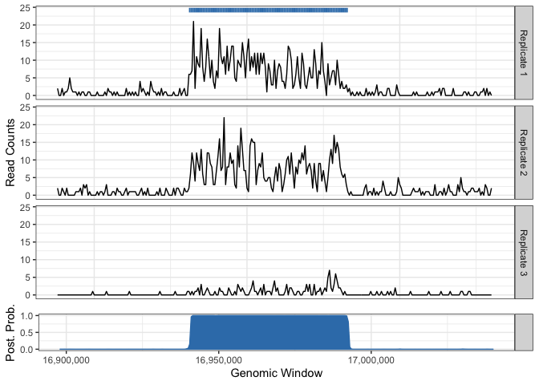

<!-- README.md is generated from README.Rmd. Please edit that file -->

# ZIMHMM

ZIMHMM (Zero Inflated Mixed effects Hidden Markov Model) is a package
with a peak caller to detect broad enrichment regions from multiple
ChIP-seq experimental replicates. `ZIMHMM()` is a multi-sample peak
caller that models the zero-inflation of background counts, accounts for
replicate-specific differences via a mixed effects model, and ensures
that broad regions of enrichment are detected by fitting a hidden Markov
model. This package also contains `ZIHMM()`, a fixed effects version of
the peak caller. `ZIHMM()` can be used in single- and multi-sample
settings. The function `controlPeaks()` provides parameters that control
the Expectation-Maximization (EM) algorithm from the presented peak
callers. Please refer to their documentation (e.g. `?ZIMHMM::ZIMHMM`)
for details. The paper for ZIMHMM was published in the Biometrics
journal. [Click
here](https://onlinelibrary.wiley.com/doi/abs/10.1111/biom.13083) to
read it.

## Installation

You can install the released version of ZIMHMM from this repository
with:

``` r
devtools::install_github("plbaldoni/ZIMHMM")
```

## Example

The package contains an example dataset with H3K36me3 ChIP-seq (and
input control) read counts from chromosome 19 of three technical
replicates of Huvec cell line (ENCODE Consortium). Reads were tabulated
using 500bp non-overlapping windows. An example of ZIMHMM is shown
below.

``` r
# Loading example dataset
data(Huvec)

# ChIP and Control read counts, as well as the model offset.
ChIP = assay(Huvec,'ChIP')
Control = log(assay(Huvec,'Control')+1)
offset = matrix(0,nrow = nrow(ChIP),ncol = ncol(ChIP))

# Calling peaks
peakcall = ZIMHMM(ChIP = ChIP,Control = Control,offset = offset,random = 'intercept',control = controlPeaks())
```

## Post-processing

The current implementation of `ZIMHMM` contains two functions for data
visualization. The first function is `plotPeaks`, which plots the
ChIP-seq read counts, the called peaks from `ZIMHMM`, and the associated
window-based posterior probabilities of enrichment. The input data
should be formatted as a `RangedSummarizedExperiment` object (such as
the example dataset Huvec).

``` r
# Plotting peak calls
plotPeaks(output = peakcall,chr = 'chr19',ranges = c(16898093,17040483),data = Huvec)
```



The second function is `makeBed`, which outputs a BED file that can be
used for visualization elsewhere (such as the UCSC Genome Browser -
<https://genome.ucsc.edu/>).

``` r
# Exporting peak calls
makeBed(peakcall, data = Huvec,file = './HuvecH3K36me3.bed')
```
